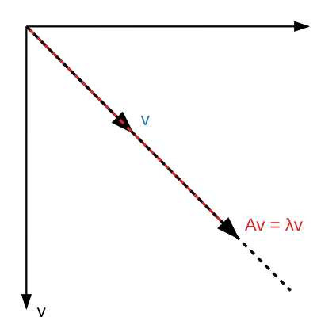

## The Core Concept

An **eigenvector** of a square matrix $A$ is a non-zero vector $v$ that changes at most by a scalar factor when that linear transformation is applied to it. The corresponding scalar factor $\lambda$ is called the **eigenvalue**.

The defining equation is:
$$
A v = \lambda v
$$

## Visualizing the Transformation

When a matrix scales a vector without changing its fundamental direction, that vector is an eigenvector. Here is a geometric representation showing an original vector $v$ and its transformation $Av$:

{width=400}

## Common 2D Transformations

Quarto handles Markdown tables beautifully for web output while still letting you use full LaTeX syntax inside the cells. Here are common 2D transformation matrices and their properties:

| Transformation Matrix $A$ | Geometric Effect | Eigenvalue(s) $\lambda$ | Eigenvector(s) $v$ |
|:---|:---|:---:|:---:|
| $\begin{bmatrix} c & 0 \\ 0 & c \end{bmatrix}$ | Uniform scaling by $c$ | $\lambda_1 = \lambda_2 = c$ | Any non-zero vector |
| $\begin{bmatrix} 1 & 0 \\ 0 & 0 \end{bmatrix}$ | Projection onto x-axis | $\lambda_1 = 1$, $\lambda_2 = 0$ | $\begin{bmatrix} 1 \\ 0 \end{bmatrix}$, $\begin{bmatrix} 0 \\ 1 \end{bmatrix}$ |
| $\begin{bmatrix} 0 & -1 \\ 1 & 0 \end{bmatrix}$ | $90^\circ$ Rotation | None (in $\mathbb{R}$) | None (in $\mathbb{R}$) |